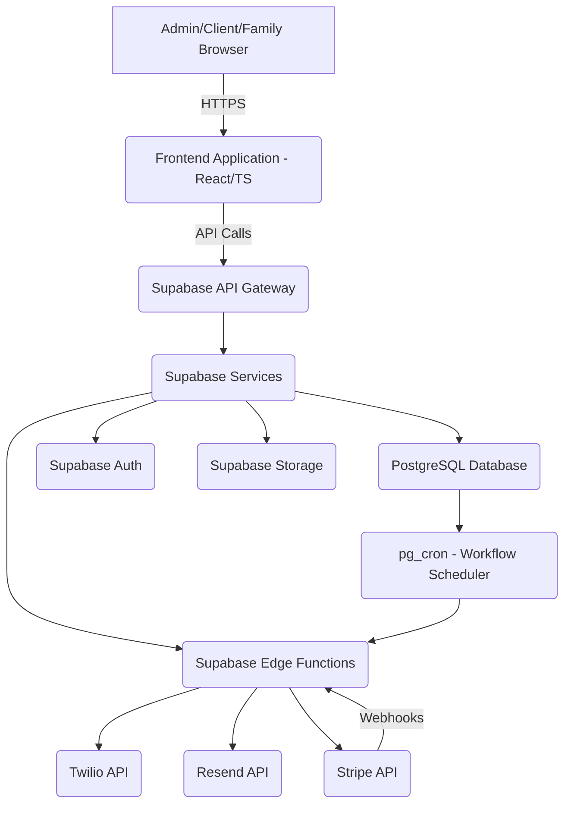

# Technical Stack and Architecture: Rustic Retreat CRM

**Document Version:** 1.2
**Date:** January 20, 2026
**Author:** Manus AI
**Goal:** To define the technology stack and architectural patterns for the Rustic Retreat CRM, ensuring scalability, security, and developer efficiency.

***

## 1. Technology Stack Summary

The CRM will be built using a modern, full-stack JavaScript architecture, leveraging a "Backend-as-a-Service" approach for rapid development and scalability.

| Layer | Technology | Purpose |
| :--- | :--- | :--- |
| **Frontend** | React, TypeScript, Next.js/Vite, Tailwind CSS, shadcn/ui | User Interface, Routing, State Management, Component Library. |
| **Backend/Database** | **Supabase** (PostgreSQL) | Database, Authentication, Storage, Realtime, Edge Functions (Serverless). |
| **State Management** | TanStack Query (React Query) | Data fetching, caching, synchronization, and state management. |
| **Form Management** | React Hook Form, Zod | Form validation and state handling. |
| **Communication** | **Twilio** (SMS), **Resend** (Email) | Automated and manual client communication. |
| **Contracts** | E-signature provider (TBD, e.g., DocuSign) | Contract generation and signing. |
| **Payments** | **Stripe** | Payment processing and webhook handling. |

## 2. Architectural Diagram

The architecture follows a standard client-server model, heavily utilizing Supabase services to minimize custom server-side code.

## 3. Key Architectural Decisions

### 3.1. Supabase as the Core Backend

*   **Database:** PostgreSQL provides robust relational capabilities, essential for complex data like bookings, payments, and guests.
*   **Authentication:** Supabase Auth will handle user sign-up, login, and session management for all three roles (Admin, Client, Family).
*   **Security (CRITICAL):** **Row Level Security (RLS)** will be enabled on all tables. This is the primary mechanism for ensuring clients can only access their own booking data and staff can only access operational data.
*   **Edge Functions:** Used for secure, server-side logic that requires API keys (e.g., Twilio, Stripe, Resend) or scheduled execution (Workflows).

### 3.2. Frontend Framework

*   **React/TypeScript:** Provides a modern, type-safe, and component-based development environment.
*   **TanStack Query:** Essential for managing the complex asynchronous state (bookings, payments, checklists) and ensuring a fast, responsive user experience.
*   **shadcn/ui:** Provides a set of accessible, composable UI components built on Tailwind CSS, accelerating development of the Admin and Client portals.

### 3.3. Communication Integration

*   **Twilio (SMS):** Integrated via a Supabase Edge Function to securely send automated and manual SMS messages. This ensures the Twilio API key is never exposed client-side.
*   **Resend (Email):** Integrated via a Supabase Edge Function for high-deliverability email communication (contracts, reminders).
*   **Timezone:** All workflows and reminders run in **Mountain Time (Alberta)** to align with venue operations.
*   **Venue Identity:** Contracts and outbound communications use the business name **Rustic Retreat Weddings and Events** with the Lac Saint Anne County, Alberta address (placeholder until finalized).

### 3.4. Workflow Execution

*   **pg_cron:** The PostgreSQL extension will be used to schedule a daily cron job that calls a specific Supabase Edge Function (`execute-workflows`).
*   **Workflow Executor:** This Edge Function will query the `automated_workflows` table, execute any due tasks (e.g., send payment reminders), and update the workflow status. This decouples the scheduling from the application logic.

### 3.5. Pricing, Tax, and Payment Schedule

*   **GST:** Apply **5% GST** to package and upsells; rate is admin-configurable via `venue_settings`.
*   **Payment Schedule Engine:** Generates 25% non-refundable deposit at contract, 50% at -90 days, 25% at -60 days; last-minute (<7 days) generates a single 100% payment.
*   **Damage Deposit:** $500 collected at check-in and tracked in `damage_deposits`; refunds processed within **7 days after booking end** post-inspection.
*   **Pricing Controls:** All package base prices, included counts (camping 60, RV 15), and upsell unit prices (additional RV, additional tent camping, firewood) live in `venue_settings` and are editable via admin UI (no code changes required for yearly updates).

## 4. Data Model Highlights

The data model is designed to support the complex validation and upsell tracking required by Rustic Retreat.

| Entity | Key Fields & Relationships | Notes |
| :--- | :--- | :--- |
| `users` | `id` (FK to `auth.users`), `role` (ENUM: 'admin', 'client', 'family') | Enforces RLS and role-based access. |
| `bookings` | `client_name`, `client_email`, `package_type` (ENUM: '3_day_weekend', '5_day_extended', '10_day_experience'), `start_date`, `end_date`, `is_last_minute`, `non_refundable_deposit_amount` | Core booking record; supports all package durations; validation enforces season and single-inventory rules. |
| `guests` | `booking_id`, `guest_type` (ENUM: 'reception', 'camping', 'rv', 'tent'), `arrival_date`, `departure_date`, `unit_size` (RV), `site_type` | Detailed tracking for capacity and upsell calculation. |
| `payments` | `booking_id`, `payment_type`, `amount`, `due_date`, `status` | Tracks scheduled and paid amounts. |
| **`upsells`** | `booking_id`, `type` (ENUM: 'rv_site_overage', 'tent_camping_overage', 'firewood_bundle'), `quantity`, `unit_price` | Tracks overage add-ons only; defaults configurable by admin. |
| `damage_deposits` | `booking_id`, `amount`, `status`, `collected_at`, `refunded_at`, `notes` | Manages $500 deposit collection at check-in and refund/deduction workflow (7-day target). |
| `venue_settings` | `gst_rate`, `max_reception_guests`, `season_start`, `season_end`, `deposit_percent`, `payment_offsets`, `package_base_prices`, `included_camping_guests`, `included_rv_sites`, `upsell_unit_prices` | Admin-configurable controls for Alberta-specific rules, caps, and yearly pricing updates (package and upsell). |
| `contacts` | `name`, `email`, `phone`, `contact_type`, `booking_id` | Base contact record for unified messaging (clients, vendors, leads). |
| `message_threads` | `contact_id`, `subject`, `last_message_at`, `unread_count` | Thread-level metadata for inbox views. |
| `messages` | `thread_id`, `direction`, `channel`, `from_address`, `to_address`, `subject`, `body`, `status`, `external_id` | Stores inbound/outbound SMS & email messages; links to Stripe/Twilio/Resend IDs. |
| `contracts` | `booking_id`, `status`, `signed_pdf_url`, `client_ip_address` | Legal record, ensures non-repudiation. |
| `client_checklist` (NEW) | `booking_id`, `task_name`, `due_date`, `is_complete` | Client-facing planning tool. |
| `automated_workflows` | `booking_id`, `workflow_type`, `scheduled_for`, `status` | Tracks all automated communication tasks. |

***

## 5. Development Environment Setup

The project will use the following standard setup:

1.  **Project Initialization:** `npm install` for dependencies.
2.  **Supabase CLI:** Used for local development, migration management (`supabase db push`), and deployment.
3.  **Environment Variables:** Securely store API keys and service URLs in `.env.local` and production environment variables.

| Variable | Usage | Security |
| :--- | :--- | :--- |
| `VITE_SUPABASE_URL`, `VITE_SUPABASE_ANON_KEY` | Client-side Supabase connection. | Low risk (Anon Key is public). |
| `SUPABASE_SERVICE_KEY` | Server-side/Edge Function access. | **HIGH RISK - MUST BE SECRET.** |
| `TWILIO_ACCOUNT_SID`, `TWILIO_AUTH_TOKEN` | Twilio API credentials. | **HIGH RISK - MUST BE SECRET.** |
| `STRIPE_SECRET_KEY`, `RESEND_API_KEY` | Payment/Email API credentials. | **HIGH RISK - MUST BE SECRET.** |

All high-risk secrets **MUST** be stored as environment variables accessible only to the Supabase Edge Functions and not exposed in the client-side code.
